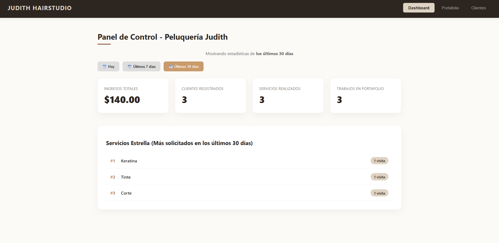
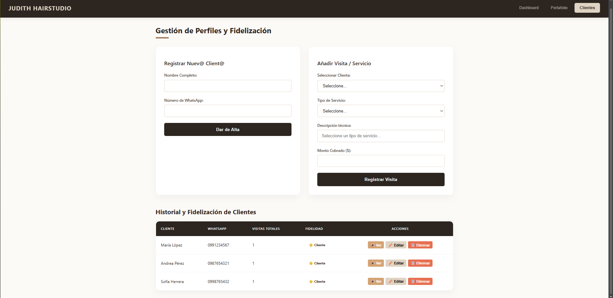
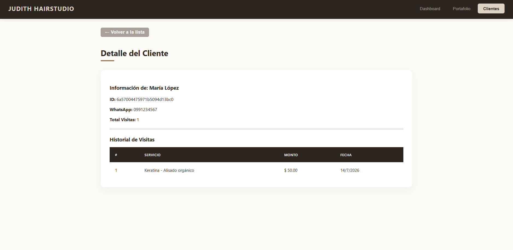
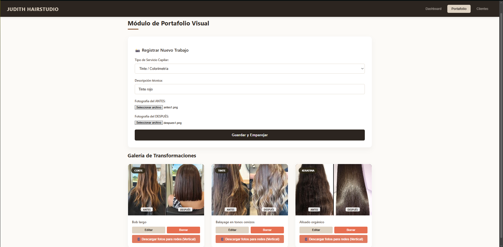

# 💇 Judith HairStudio — Salon Management System

[](https://github.com/aledash3/judith-hairstudio/actions)
[](https://nodejs.org/)
[](https://pnpm.io/)
[](https://react.dev/)
[](https://expressjs.com/)
[](https://www.mongodb.com/)
[](LICENSE)
[](README.es.md)

A production-ready Full-Stack MERN web application engineered for beauty salons, hairdressers, and aesthetics centers. It centralizes client management, visit and revenue tracking, real-time analytics, and a WebP-optimized hairstyle transformation portfolio with automated social media asset generation.

> 🌐 **Language / Idioma:** English | [Leer documentación en Español](README.es.md)

---

## 🖥️ Application Interface

| Dashboard Metrics | Client Directory |
| :---: | :---: |
|  |  |

| Client Visit Details | Transformation Portfolio |
| :---: | :---: |
|  |  |

> *Note: Screenshots display fictional placeholder data for demonstration purposes.*

---

## 📌 Features

### 👥 Client & Visit Management
- Complete CRUD operations (Create, Read, Update, Delete) for clients and visit histories.
- MongoDB internal `_id` identity tracking (no sensitive ID card numbers stored).
- Robust validation for Ecuadorian mobile phone numbers (strictly 10 digits starting with `09`).
- Family-friendly phone sharing: allows different individuals (e.g., family members) to share phone numbers.
- Name deduplication: intelligent duplicate blocking only when normalized full name and phone number match.
- Visit logs with non-negative revenue validation, service timestamps, and treatment notes.

### 📊 Real-Time Analytics Dashboard
- Key performance metrics: total clients, cumulative revenue, total visits, and average ticket size.
- Aggregated insights highlighting top-requested services and recurring customer loyalty rates.
- Service breakdown charts for daily and monthly business tracking.

### 📸 Portfolio & WebP Image Pipeline
- Before/After hair transformation showcase with categorized styling techniques.
- Automated server-side image processing and compression to high-performance WebP using `sharp`.
- Built-in social media export tool for vertical compositions optimized for Instagram Stories and TikTok.

---

## 🏗 System Architecture

The project is structured as a **pnpm monorepo workspace** with strict separation of concerns following the MVC architectural pattern:

```text
React 18 + Vite (Frontend)
    │
    │  Axios Client / Development Proxy
    ▼
Express.js REST API (Backend)
    │
    ├── Middleware (Auth, Uploads, Error Handling, Request Validators)
    ├── Routers (Decoupled route endpoints)
    ├── Controllers (HTTP request/response handling)
    ├── Services (Business logic & domain validation)
    └── Models (Mongoose Schemas & MongoDB indexes)
    │
    ▼
MongoDB (Database)
```

---

## 📁 Repository Structure

```text
judith-hairstudio/
├── .github/
│   └── workflows/
│       └── ci.yml               # Automated CI pipeline (pnpm install, test, lint, build)
├── backend/
│   ├── config/                  # Database connectivity (MongoDB / Mongoose)
│   ├── controllers/             # HTTP controller handlers
│   ├── middlewares/             # Upload (Multer), async handler, error middleware
│   ├── models/                  # Cliente and Portafolio Mongoose schemas
│   ├── routers/                 # API endpoint routers
│   ├── scripts/                 # Migration scripts (index cleanup)
│   ├── services/                # Core business logic
│   ├── test/                    # Unit tests using Node.js native test runner
│   ├── utils/                   # Custom HTTP error helpers
│   ├── validators/              # Input sanitization and phone/revenue validators
│   ├── package.json             # Backend dependencies & scripts
│   └── server.js                # Express application bootstrapping
├── frontend/
│   ├── src/
│   │   ├── pages/               # Clientes, Dashboard, Portafolio views
│   │   ├── services/            # Centralized Axios API client
│   │   ├── styles/              # Custom responsive CSS design system
│   │   ├── App.jsx              # React router configuration
│   │   └── index.jsx            # Application entrypoint
│   ├── index.html               # Single Page Application template
│   ├── package.json             # Frontend dependencies & scripts
│   └── vite.config.js           # Vite dev proxy and build configuration
├── docs/                        # Application UI screenshots
├── .gitignore                   # Standard gitignore (node_modules, .env, uploads)
├── .npmrc                       # Strict engine and peer dependencies rules
├── pnpm-lock.yaml               # Reproducible pnpm dependency lockfile
├── pnpm-workspace.yaml          # Monorepo workspace configuration
├── package.json                 # Monorepo root scripts and engines declaration
├── LICENSE                      # MIT License
├── README.md                    # English technical documentation
└── README.es.md                 # Spanish documentation
```

---

## 🛠 Tech Stack

| Layer | Technologies |
| --- | --- |
| **Frontend** | React 18, Vite 5, React Router 7, Axios, CSS Modules / Custom Palette |
| **Backend** | Node.js 20, Express 4, Multer, Sharp, Mongoose 8, MongoDB Native Driver |
| **Tooling & Monorepo** | pnpm 11 Workspace, ESLint 9, Node.js Test Runner |
| **CI / DevOps** | GitHub Actions, Git |

---

## 🚀 Getting Started

### Prerequisites
- **Node.js**: `>= 22.0.0`
- **pnpm**: `>= 11.0.0` (Install globally with `npm install -g pnpm` or `corepack enable`)
- **MongoDB**: Local MongoDB instance or MongoDB Atlas cluster.

### 1. Clone the Repository
```bash
git clone https://github.com/aledash3/judith-hairstudio.git
cd judith-hairstudio
```

### 2. Install Workspace Dependencies
```bash
pnpm install
```

### 3. Environment Configuration
Create the backend environment file from the provided template:
```bash
# In backend/.env
PORT=5000
NODE_ENV=development
CORS_ORIGIN=http://localhost:3000
MONGO_URI=mongodb://localhost:27017/judith-hairstudio
```

For the frontend, configure `frontend/.env`:
```bash
# In frontend/.env
# Leave blank during local development to use the Vite reverse proxy
VITE_API_URL=
```

### 4. Running the Application
```bash
# Run backend and frontend concurrently
pnpm dev

# Or run services independently
pnpm dev:backend   # API on http://localhost:5000
pnpm dev:frontend  # UI on http://localhost:3000
```

---

## 🧪 Testing & Code Quality

The monorepo includes automated unit tests, linting, and production build checks:

```bash
# Run backend unit tests (Node.js native test runner)
pnpm test

# Run ESLint across frontend code
pnpm lint

# Compile production build of frontend
pnpm build
```

---

## 🔌 RESTful API Reference

| HTTP Method | Endpoint | Description |
| :--- | :--- | :--- |
| `GET` | `/health` | Service health status check |
| `GET` | `/api/dashboard/metricas` | Aggregated dashboard analytics & revenue metrics |
| `GET` | `/api/clientes` | Retrieve all registered clients |
| `POST` | `/api/clientes` | Create a new client profile |
| `GET` | `/api/clientes/:id` | Fetch client details and visit history |
| `POST` | `/api/clientes/:id/visitas` | Record a new client appointment / visit |
| `PUT` | `/api/clientes/:id` | Update client profile information |
| `DELETE` | `/api/clientes/:id` | Remove a client profile |
| `GET` | `/api/portafolio` | Fetch all portfolio entries |
| `POST` | `/api/portafolio` | Upload a new portfolio transformation (with images) |
| `PUT` | `/api/portafolio/:id` | Update portfolio entry details |
| `DELETE` | `/api/portafolio/:id` | Delete a portfolio entry and its assets |

---

## 👨‍💻 Author

**David Alejandro Cruz Palacios**  
Computer Science Engineering Student — Universidad Politécnica Salesiana  
GitHub: [@aledash3](https://github.com/aledash3)

---

## 📄 License

This project is licensed under the terms of the [MIT License](LICENSE).
